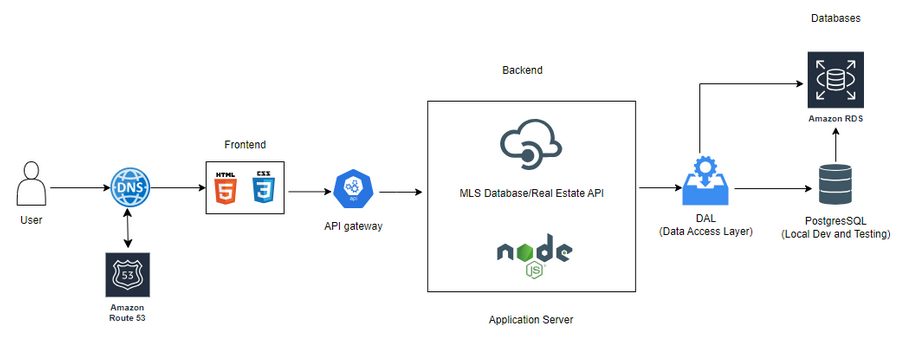

# EtsiGuesser
## The real estate price guessing game

## Overview
EstiGuessr is a browser-based game where you, the player, will be provided with pictures of homes for sale through the MLS or similar API. You will then have to use that, combined with the location of the home to guess it’s price after which you will be scored based on how close your guess was. Once on the website you will be prompted with a username, then your best score will then be added to a leaderboard where you can try to reach the top 10 scores. The website will be hosted via Amazon Web Services.

## About Us
- Mason Schierbeck: Front-End development and web design
- Sam Sliefert: Back-End development and database management
- Fredrick Kamau: Back-End development and database management

## Updates
### Design

### Code Explained

## Milestones
- 09/21/2023: Concept and Design Phase - Completed
- 10/05/2023: Set up development environment on GitHub and local - Completed
- 12/20/2023: Prototyping - Completed
- 01/05/2024: Alpha SW - On Track
- 01/30/2024: Beta SW - On Track
- 02/29/2024: Usability SW and Beta Testing - On Track
- 03/25/2024: Go live - On Track
